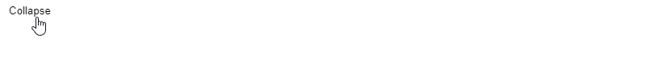

# React-Collapsus



A Styled-Component based collapse package.

## Recommendations 

npm 6.12.0+

node v12.13.0+

### Browsers
`
  ">0.2%",
  "not dead",
  "not op_mini all"
`
## Instalation

```
npm i react-collapsus
```

## Storybook

[Storybook with examples](https://knighteq.github.io/react-collapsus/?path=/story/collapsus--default)

## Usage

```jsx
import { Collapsus } from 'react-collapsus';

<Collapsus 
  actionButtonText="Collapse"
  content="Content text" 
/>
```

## Props

### actionButtonComponent: React.ElementType

Here can be passed a styled-component with own styling.

### actionButtonText: string

Just the text in the action button.

### content: React.ReactNode

Collapsed content, it can be a node.

### transitionTime: number

Animation time (default 300ms).

